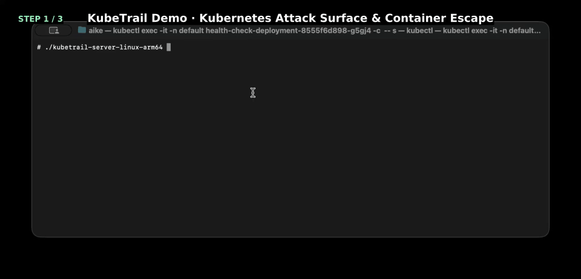

<h1 align="center">KubeTrail</h1>

<p align="center">English | <a href="./README.md">中文</a><br></p>

<div align="center">


</div>

> [!WARNING]
> KubeTrail is intended only for explicitly authorized Kubernetes clusters, namespaces, Pods, or lab environments during security testing, red-team assessment, defensive validation, and security auditing. Unauthorized use may be illegal, and users are solely responsible for their actions.

KubeTrail is an in-pod Kubernetes situational awareness, attack-surface discovery, and AI-assisted offensive/defensive orchestration tool for authorized red-team assessments and defensive validation. It collects local environment, ServiceAccount, Kubernetes API permission, escape-surface, credential trace, and cloud metadata evidence, then writes structured JSON for client-side audit, replay, interactive analysis, EXP validation planning, reporting, and controlled dynamic attack validation.

## Usage Video and Case Study



## Key Features

- **Native in-pod collection**: uses the in-cluster ServiceAccount to access the Kubernetes API directly, without `kubectl` or extra operations tooling.
- **Tiered safety modes**: `safe` focuses on local read-only and Kubernetes API read-only evidence collection; `full` enables active validation such as network probes, Admission dry-run, and syscall probes.
- **Attack-surface evidence aggregation**: collects ServiceAccount, RBAC, Pod security context, runtime socket, hostPath, cgroup, `/proc`, `/sys`, LPE, credential trace, and cloud metadata signals.
- **Sensitive data egress protection**: supports `raw`, `redact`, and `metadata` sensitive-data strategies; Agent uses references for sensitive evidence by default to reduce the risk of sending tokens, keys, or credential material to LLMs or external services.
- **AI dynamic attack orchestration**: Agent supports Claude/Codex providers and can combine collected facts, attack-surface skills, EXP Forge, C2 MCP, and live feedback to adjust validation paths inside the authorized scope.
- **Local post-exploitation workbench**: the desktop app manages kubeconfigs, Pod/Node interactions, port forwarding, file access, and C2 MCP sessions for evidence review, permission consolidation, and follow-on operation orchestration.
- **Fast persistence workflows**: includes ServiceAccount/RBAC, CSR, sidecar patch, pull secret, CronJob/Deployment template notes and cleanup guidance for rapid generation, validation, and replay of persistence paths.

Note: C2 orchestration integrates with external operator-owned C2 infrastructure through MCP. This repository keeps only the integration entry points and invocation constraints; the C2 server is not open sourced.

## Quick Start

### Requirements

- Go 1.26 or newer.
- Node.js 18+ for `apps/agent` and the desktop frontend.
- Wails for developing or building `apps/desktop`.
- Optional local `claude` or `codex` CLI for desktop Agent SDK runtime integration.

### Build

Build server release artifacts:

```bash
./scripts/build-release.sh
```

```powershell
.\scripts\build-release.ps1
```

The server release scripts run `go test ./...`, use `-trimpath`, `-buildvcs=false`, strip debug/symbol data, clear the Go build ID, and write multi-platform `kubetrail-server-*` binaries plus `SHA256SUMS`. Use `./scripts/build-secure-upx.sh` when you need a UPX-compressed server build.

Package the desktop app and Agent runtime assets:

```bash
./scripts/build-client.sh
```

```powershell
.\scripts\build-client.ps1
```

## Server Options

| Option | Default | Purpose |
| --- | --- | --- |
| `--mode` / `-m` | `safe` | Collection mode: `safe` or `full`. |
| `--output` / `-o` | `dbus.json` | Main JSON output path; `-` writes to stdout. |
| `--pretty` / `-p` | `false` | Pretty-print JSON. |
| `--timeout` / `-t` | `60s` | Overall collection timeout. Timed-out runs still output collected partial facts and errors. |
| `--sensitive` / `-v` | `raw` | Sensitive fact handling: `raw`, `redact`, or `metadata`. |
| `--rbac-mode` / `-r` | `focused` | RBAC audit depth: `focused` checks high-value paths; `full` runs the full matrix and wildcard expansion. |
| `--scan` / `-s` | `all` | Limit collection categories, comma-separated, for example `-s lpe,rbac`. |
| `--credential-sweep` / `-c` | `true` | Common credential file sweep; use `-c=false` to disable. |
| `--secretoutput path` / `-secret path` | empty | Write a separate ServiceAccount token audit JSON with raw visible legacy token Secrets and per-token permission checks. |
| `--kubeconfig` / `-k` | empty | Use local kubeconfig; empty uses in-cluster ServiceAccount. |
| `--max-items` / `-n` | `100` | Maximum objects per Kubernetes list request. |

## Common Red-Team Workflow

The following workflow assumes an authorized exercise, assessment, or lab environment. Before running it, confirm that the target cluster, namespace, Pod, credentials, and active validation actions are in scope.

1. Baseline from a container foothold

   Upload and run `kubetrail-server` from an acquired container shell, debug container, or test Pod. Start with `safe` mode to build baseline evidence and the common high-value RBAC matrix.

   ```bash
   ./kubetrail-server -m safe -o dbus.json
   ```

   Focus on identity, namespace, ServiceAccount, mounts, runtime sockets, hostPath, privileged mode, Linux capabilities, process/namespace/cgroup clues, and Kubernetes API visibility.
   High-value signals include `secrets get/list`, `pods create`, `pods/exec`, `pods/attach`, `pods/portforward`, `pods/ephemeralcontainers patch`, `serviceaccounts/token create`, RBAC `bind/escalate`, `impersonate`, workload controller write access, mutating webhook write access, and `nodes/proxy`.

2. RBAC and lateral-path confirmation

   Default `safe` collection already includes the common high-value RBAC matrix and is suitable for quickly judging whether the current ServiceAccount has lateral movement, privilege escalation, or cluster takeover potential. Run a deeper RBAC audit when you need broader permission coverage.

   ```bash
   ./kubetrail-server -m safe -s rbac -r full -o rbac.json
   ```

   `-r full` expands SSRR/SSAR, wildcard, and discovery-related checks, so it creates more API Server calls than the default focused mode. If defenders monitor apiserver audit logs or anomalous call patterns, this behavior may be detected.

3. Local LPE and escape focus

   To reduce Kubernetes object-enumeration noise and focus on local container escape and LPE clues:

   ```bash
   ./kubetrail-server -m safe -s lpe,escape -o local-attack-surface.json
   ```

   Common focus points include privileged containers, host namespaces, hostPath, Docker/containerd/CRI sockets, dangerous capabilities, writable sensitive paths, proc/sys exposure, node-local network, and known LPE environment traits.

4. Active validation pre-check

   Run `full` only when the authorization scope allows observable requests. This mode adds DNS queries, cloud metadata HTTP probes, Admission dry-run, and syscall probes.

   ```bash
   ./kubetrail-server -m full -r focused -o full.json
   ```

   `full` is useful for validating cloud metadata reachability, Admission constraints, service discovery exposure, and local syscall behavior.

5. Visible ServiceAccount token audit

   When the authorized target includes legacy ServiceAccount token Secret auditing, export visible tokens and check each token's permissions.

   ```bash
   ./kubetrail-server -m safe -secret secret-audit.json -r full -o dbus.json
   ```

6. Agent-assisted analysis and EXP planning

   Pass `dbus.json` to `apps/agent` so the Agent can list attack surfaces, evidence, risk ordering, and validation templates from facts.

   Before generating an EXP bundle, confirm that template parameters, target namespace, ServiceAccount, image, and cleanup commands are authorized for the exercise.

7. Desktop integration

   The desktop app is useful during an assessment for browsing resources, importing scan results, reviewing Pod/Node context, managing Agent sessions, and generating validation materials.

   Pod terminal, Node terminal, port forwarding, persistence resource creation, and shadow kubeconfig features should be separately authorized because they may change cluster state or leave audit records.

## Kubernetes API Behavior

KubeTrail does not call `kubectl`. In a Pod, it uses the mounted ServiceAccount to access the Kubernetes API; for local testing, pass `--kubeconfig`.

Collection output depends on the current identity's actual permissions:

- If it can only read the current namespace, output focuses on that namespace and current workload.
- If it can read across namespaces, KubeTrail collects broader resource and permission evidence.
- Denied API requests are recorded as structured errors and already collected facts are still emitted.
- High-risk permissions such as `nodes/proxy` are recorded as authorization signals only; direct active probing belongs in `full` or client-side EXP validation plans.

## Sensitive Data Handling

Default `--sensitive raw` preserves raw evidence for local authorized research, but output should be treated as sensitive assessment material.

When results leave the operator workstation or enter a reporting workflow, prefer redaction:

```bash
./kubetrail-server --mode safe --sensitive redact --output dbus.json
```

`credential_sweep` is enabled by default and may collect Kubernetes, cloud provider, image registry, CI/CD, and workload identity credential files. `--secretoutput` is explicit opt-in and exports raw tokens.

## Desktop App

`apps/desktop` is an experimental Wails desktop app with a Go backend and Vue + Element Plus frontend. Current capabilities include:

- Saving and testing cluster connections.
- Browsing namespaces, Pods, Nodes, and related resources.
- Viewing Pod logs, entering Pod terminals, and uploading/downloading/reading/deleting Pod files.
- Entering Node terminals through helper Pod, chroot, or nsenter workflows, and browsing Node files.
- Port forwarding and preset recon.
- Importing or running KubeTrail scan results.
- Managing Agent configuration, skills, chat sessions, EXP templates, and report export.
- Assisting persistence resource, ServiceAccount token, and shadow kubeconfig generation.

The Node Shell helper Pod uses this image by default:

```text
docker.io/nicolaka/netshoot:v0.13
```

Override it with:

```bash
export KUBETRAIL_NODE_SHELL_IMAGE=registry.example.com/security/netshoot:latest
```

The desktop app does not bundle the `claude` or `codex` CLI. Ensure the corresponding CLI is on `PATH`, or set `KUBETRAIL_AGENT_PATH_TO_CLAUDE` / `KUBETRAIL_AGENT_PATH_TO_CODEX`.

## Detection Capability Matrix

KubeTrail server collects facts and generates heuristic findings; Agent, EXP Forge, and the desktop app turn facts into validation plans, controlled actions, and replay reports.

### Linux LPE / K8s Container Vulnerabilities

| Detection item | Main evidence/component | Validation and boundary |
| --- | --- | --- |
| Dirty Frag RxRPC CVE-2026-43500 | `lpe.kernel`, `lpe.kernel_config`, `lpe.modules`, `lpe.sysctls` | Requires RxRPC reachability plus namespace/capability prerequisites. |
| Dirty Frag xfrm-ESP CVE-2026-43284 | `lpe.kernel`, `lpe.kernel_config`, `lpe.modules`, `lpe.sysctls` | Requires xfrm/ESP reachability plus userns or `CAP_SYS_ADMIN`. |
| PackageKit TOCTOU CVE-2026-41651 | `lpe.packages` | Version signal only; D-Bus activation, service reachability, and distro patches need review. |
| Copy Fail AF_ALG CVE-2026-31431 | `lpe.kernel`, `lpe.kernel_config` | Detects AF_ALG AEAD/authenc kernel config and version-range signals. |
| sudo chroot LPE CVE-2025-32463 | `lpe.packages`, `lpe.suid_tools` | Detects sudo 1.9.14-1.9.17 signals; patch status and local prerequisites need confirmation. |
| nf_tables CVE-2024-1086 | `lpe.kernel`, `lpe.modules`, `lpe.sysctls` | Checks nf_tables, userns, and kernel version; caveats such as `CONFIG_INIT_ON_ALLOC_DEFAULT_ON` reduce confidence. |
| OverlayFS CVE-2023-0386 | `lpe.kernel`, `lpe.modules`, `lpe.filesystems`, `lpe.sysctls` | Focuses on OverlayFS, FUSE, userns, and kernel-version combinations; distro patches must be checked. |
| Dirty Pipe CVE-2022-0847 | `lpe.kernel` | Detects kernel version range; container isolation, backports, and write-target conditions need review. |
| fs_context CVE-2022-0185 | `lpe.kernel`, `lpe.sysctls`, `lpe.process_security` | Requires kernel range plus userns or `CAP_SYS_ADMIN` prerequisites. |
| sudo Baron Samedit CVE-2021-3156 | `lpe.packages`, `lpe.suid_tools` | Based on sudo version, SUID, and current SUID transition conditions; distro backports need review. |
| PwnKit pkexec CVE-2021-4034 | `lpe.packages`, `lpe.suid_tools` | Detects polkit/policykit version and setuid `pkexec`; use `cve-2021-4034-pwnkit` for authorized validation. |
| Ubuntu OverlayFS CVE-2021-3493 | `lpe.kernel`, `lpe.modules`, `lpe.filesystems`, `lpe.sysctls` | Heuristic signal for Ubuntu kernel plus OverlayFS/userns conditions. |
| eBPF ALU32 CVE-2021-3490 | `lpe.kernel`, `lpe.kernel_config`, `lpe.sysctls` | Requires kernel range and BPF prerequisites; version hit is not exploitability proof. |
| eBPF verifier CVE-2017-16995 | `lpe.kernel`, `lpe.kernel_config`, `lpe.sysctls` | Requires kernel range, `CONFIG_BPF_SYSCALL`, and enabled unprivileged BPF. |
| setuid screen CVE-2017-5618 | `lpe.packages`, `lpe.suid_tools` | Detects screen 4.5.0 and setuid screen; binary origin and mount restrictions need confirmation. |
| Dirty COW CVE-2016-5195 | `lpe.kernel` | Detects legacy kernel range; low-confidence version signal that needs patch-state confirmation. |
| Dangerous Linux capabilities | `proc.status_security`, `lpe.process_security` | Decodes `CapEff` and identifies `CAP_SYS_ADMIN`, `CAP_SYS_MODULE`, `CAP_SYS_PTRACE`, `CAP_SYS_RAWIO`, `CAP_NET_ADMIN`, and related capabilities. |
| Seccomp disabled | `proc.status_security` | `Seccomp=0` generates an escape finding and indicates missing syscall filtering. |
| `NoNewPrivs` disabled | `proc.status_security` | `NoNewPrivs=0` amplifies SUID and exec-transition privilege escalation conditions. |
| Host namespace sharing | `proc.namespaces_self`, `proc.namespaces_pid1` | Detects PID, network, or mount namespace equality with PID 1. |
| Writable cgroup | `proc.cgroup_writable` | Detects cgroup filesystem rw mounts; safe mode only reads state and does not write control paths. |
| Block device write permission | `proc.cgroup_devices`, `filesystem.devices` | Detects whether cgroup devices allow writes to block devices. |
| cgroup `release_agent` | `proc_sys.breakout_surfaces` | Detects release_agent files and writable cgroup mounts for classic cgroup v1 breakout conditions. |
| Kernel helper path exposure | `proc_sys.breakout_surfaces` | Detects exposure and writability risks around helper paths such as `core_pattern` and `modprobe`. |
| Sensitive `/proc` and `/sys` exposure | `proc_sys.breakout_surfaces` | Detects sensitive proc/sys paths, AppArmor/SELinux/userns, and host process visibility signals. |
| Docker socket exposure | `filesystem.runtime_sockets`, `runtime.sockets` | Detects Docker socket visibility, permissions, and Docker API response; verify with `runtime-socket-verify`. |
| containerd socket exposure | `filesystem.runtime_sockets`, `runtime.sockets` | Detects containerd socket path and current-user writability. |
| CRI-O / CRI socket exposure | `filesystem.runtime_sockets`, `runtime.sockets` | Detects CRI sockets as container escape and node-control signals. |
| Docker/runc/containerd version risk | `runtime.versions` | Identifies known-risk version ranges; patch status still needs confirmation. |
| hostPath mount | `filesystem.volume_hints`, `k8s_profile.current_pod_structured` | Identifies hostPath in current container mounts or Pod spec; validate with `pod-hostpath`. |
| Writable bind mount without `nosuid` | `filesystem.writable_bind_mounts_without_nosuid` | Identifies mount conditions that may amplify SUID privilege escalation. |
| Privileged container | `k8s_profile.current_pod_structured`, `k8s_context.current_pod` | Current Pod container `privileged=true` generates a critical escape finding. |
| hostPID | `k8s_profile.current_pod_structured`, `admission_dryrun.pods` | Detects current Pod hostPID or validates whether Admission allows hostPID Pod creation in `full`. |
| hostNetwork | `k8s_profile.current_pod_structured`, `admission_dryrun.pods` | Detects current Pod hostNetwork or validates Admission behavior with dry-run. |
| hostIPC | `k8s_profile.current_pod_structured` | Detects whether the current Pod shares the host IPC namespace. |
| Unconfined seccomp | `k8s_profile.current_pod_structured`, `admission_dryrun.pods` | Detects Pod/Container `seccompProfile.type=Unconfined`. |
| Dangerous Pod capability | `k8s_profile.current_pod_structured`, `admission_dryrun.pods` | Detects dangerous capabilities added in Pod specs, such as `SYS_ADMIN`. |
| Syscall behavior probing | `syscalls.matrix` | `full` mode runs local syscall probes such as `keyctl`, `perf_event_open`, and `mount`. |

### K8s RBAC Permission Detection

| Detection item | Main evidence/component | Validation and boundary |
| --- | --- | --- |
| Current user identity | `identity.current_user` | Collects UID, GID, EUID, EGID, and username. |
| Kubernetes environment variables | `environment.kubernetes` | Identifies API Server env vars, in-Pod hints, and baseline environment context. |
| Secret-like environment variables | `environment.secret_like` | Flags environment names and values that look like tokens, passwords, secrets, or access keys. |
| ServiceAccount token mount | `serviceaccount.mounted` | Collects token, CA, and namespace files; raw material follows `--sensitive`. |
| ServiceAccount not mounted | `serviceaccount.not_found` | Records default SA path absence to help assess token automount state. |
| Kubernetes API reachability | `k8s_context.version`, `k8s_context.unavailable` | Reads `/version` or records client initialization/access failure. |
| Kubernetes Discovery resource surface | `k8s_context.discovery` | Summarizes API groups, resource count, and high-value resources. |
| Current Pod resolution | `k8s_profile.current_pod_resolution` | Locates the current Pod through hostname, env, cgroup Pod UID, or container IDs. |
| Current Pod structured profile | `k8s_profile.current_pod_structured` | Summarizes Pod metadata, securityContext, containers, volumes, and status. |
| Secret references | `k8s_profile.current_pod_references` | Identifies secret volumes, secret env, projected sources, and imagePullSecrets. |
| ConfigMap references | `k8s_profile.current_pod_references` | Identifies configMap volumes, env, and envFrom sources. |
| PVC references | `k8s_profile.current_pod_references` | Identifies persistentVolumeClaims bound to the Pod. |
| Projected token references | `k8s_profile.current_pod_references` | Identifies projected ServiceAccount token audience, path, expiration, and related clues. |
| Pod owner chain | `k8s_profile.owner_chain` | Tracks Deployment, DaemonSet, StatefulSet, Job, CronJob, and other owners. |
| Namespace context | `k8s_profile.namespace_context` | Summarizes Namespace labels, annotations, and Pod Security Admission signals. |
| Node context | `k8s_profile.node_context` | Summarizes current Node OS, labels, taints, and addresses when permission allows. |
| NetworkPolicy context | `k8s_profile.network_context` | Summarizes NetworkPolicy, Service, Ingress, Gateway, and related network objects. |
| Admission/Policy components | `k8s_profile.policy_security_components` | Identifies PSA, webhooks, Gatekeeper/Kyverno-like policy components, and policy configuration surfaces. |
| SSRR permission rules | `k8s_permissions.self_subject_rules` | Records SelfSubjectRulesReview output for the current identity in the namespace. |
| Secret read permission | `k8s_permissions.high_value_access` | Checks `secrets get/list` and `kube-system secrets get/list` high-value read permissions. |
| Pod creation permission | `k8s_permissions.high_value_access` | Checks `pods create` for workload creation, escape validation, and persistence prerequisites. |
| Pod exec/attach permission | `k8s_permissions.high_value_access`, `pods-exec-verify` | Checks `pods/exec` and `pods/attach`; can generate read-only validation commands. |
| Pod port-forward permission | `k8s_permissions.high_value_access` | Checks `pods/portforward` for internal service access paths. |
| Ephemeral container permission | `k8s_permissions.high_value_access`, `ephemeralcontainers-patch` | Checks `pods/ephemeralcontainers patch/update`; can generate controlled patch validation materials. |
| ServiceAccount token creation | `k8s_permissions.high_value_access` | Checks `serviceaccounts/token create` for short-lived token minting risk. |
| RBAC bind permission | `k8s_permissions.high_value_access`, `rbac-bind-escalate-verify` | Checks Role/ClusterRole bind ability; defaults to preflight generation without creating bindings. |
| RBAC escalate permission | `k8s_permissions.high_value_access`, `rbac-bind-escalate-verify` | Checks Role/ClusterRole escalate ability as a high-risk escalation prerequisite. |
| Impersonation permission | `k8s_permissions.high_value_access`, `impersonate-verify` | Checks users, groups, and serviceaccounts impersonation ability. |
| `nodes/proxy` permission | `k8s_permissions.high_value_access`, `nodes-proxy-verify` | Records kubelet API bypass signals; active probing is performed by Agent/desktop only when authorized. |
| MutatingWebhook control permission | `k8s_permissions.high_value_access` | Checks mutating webhook create/update/patch as a global request interception and persistence entry point. |
| RoleBinding creation permission | `k8s_permissions.high_value_access` | Checks RoleBinding/ClusterRoleBinding create ability. |
| DaemonSet creation permission | `k8s_permissions.high_value_access` | Checks DaemonSet create as a node-level foothold and resource-abuse entry point. |
| wildcard/cluster-admin equivalence | `k8s_permissions.expanded_wildcards` | `focused` detects cluster-admin equivalence; `--rbac-mode full` expands more wildcard candidates. |
| Namespace list permission | `k8s_objects.namespaces` | Enumerates namespaces when allowed, to assess cross-namespace visibility. |
| Object list surface | `k8s_objects.permitted_lists` | Lists only resources listable by the current identity, capped by `--max-items`. |
| CRD/Operator resource surface | `k8s_context.discovery`, `k8s_objects.permitted_lists`, `operator-crd-abuse-review` | Identifies CRDs, operators, controllers, and custom resources that may be indirectly abused. |
| Legacy SA token Secret audit | `--secretoutput` / `-secret` | Explicitly exports visible legacy token Secrets, JWT claims, and per-token SSRR/SSAR. |
| Common credential file sweep | `credential_sweep.files` | Enabled by default; covers Kubernetes, cloud, registry, CI/CD, kubeconfig, Docker config, and similar paths. |
| Cloud metadata reachability | `cloud_metadata.endpoints`, `cloud-metadata-verify` | `full` creates metadata HTTP requests; Agent templates default to read-only verification. |
| Cloud identity read-only verification | `cloud-identity-verify` | Generates cloud caller-identity style read-only commands; requires authorized cloud credentials in the operator environment. |
| Kubernetes DNS service discovery | `dns_services.results` | `full` queries common Kubernetes service DNS records. |
| Service/Ingress exposure | `service-ingress-exposure-review` | Generates review commands for Services, Ingresses, Gateways, NodePorts, and LoadBalancers from visible objects. |
| Management interface exposure | `management-interface-review` | Reviews Dashboard, Argo CD, Rancher, Prometheus, Grafana, Kubeflow, and similar management entry points. |
| Lateral network paths | `network-lateral-movement-review` | Reviews NetworkPolicies, service discovery, and egress to API Server, metadata, kubelet, etcd, registry, and other sensitive endpoints. |
| kubelet API reachability | `kubelet-api-verify` | Generates kubelet health/version read-only probe commands. |
| etcd endpoint reachability | `etcd-access-verify` | Generates etcd endpoint status read-only commands; mTLS material must be authorized. |
| Registry auth verification | `registry-auth-verify` | Generates non-mutating registry manifest/auth checks. |
| Pod/Job creation validation | `pod-create-job` | `full` template that creates a short-lived Job/Pod and requires cleanup. |
| hostPath Pod validation | `pod-hostpath` | `full` template that uses a read-only hostPath Pod to validate Admission and mount risk. |
| Privileged Pod validation | `pod-privileged` | `full` template that creates a short-lived privileged Pod. |
| hostPID Pod validation | `pod-hostpid` | `full` template that creates a hostPID Pod to validate policy boundaries. |
| hostNetwork Pod validation | `pod-hostnetwork` | `full` template that creates a hostNetwork Pod to validate policy boundaries. |
| ServiceAccount/RBAC persistence | `serviceaccount-rbac-persistence` | `full` template that generates SA, Role/ClusterRole, Binding, and optional long-lived token Secret. |
| CSR client cert persistence | `csr-client-cert-persistence` | `dangerous` template that generates CSR, certificate, and kubeconfig; may issue long-lived access material. |
| Sidecar patch persistence | `workload-patch-sidecar-persistence` | `dangerous` template that patches Deployment/DaemonSet/StatefulSet templates and triggers rollout. |
| imagePullSecret injection | `pull-secret-injection` | `full` template that creates a dockerconfigjson Secret and patches a ServiceAccount. |
| Admission persistence review | `admission-persistence-review` | Read-only review of webhooks, CEL admission policies, and namespace selectors. |
| Static pod persistence review | `static-pod-node-persistence-review`, `static-pod-manifest-review` | Requires authorized node shell or hostPath perspective; reviews static Pod manifest paths only. |
| Image supply-chain review | `image-supply-chain-review` | Reviews image source, mutable tags, imagePullSecrets, registries, and signature policy; does not run vulnerability database scans. |
| Observability and defense-evasion review | `observability-evasion-review` | Reviews audit, events, logs, runtime security agents, and kubelet/etcd bypass impact. |
| Resource abuse / DoS surface | `resource-hijack-dos-review` | Reviews ResourceQuota, LimitRange, Job/CronJob/DaemonSet, GPU/CPU resource-abuse paths. |
| Windows/HostProcess container review | `windows-container-review` | Server local collectors are Linux-oriented; Windows review is generated as read-only Agent commands. |

## Special Thanks

- Kubernetes `client-go` and API machinery.
- Wails, Vue, and Element Plus.
- [quarkslab/kdigger](https://github.com/quarkslab/kdigger)
- [madhuakula/kubernetes-goat](https://github.com/madhuakula/kubernetes-goat)

## License

MIT License

### Follow the trail
